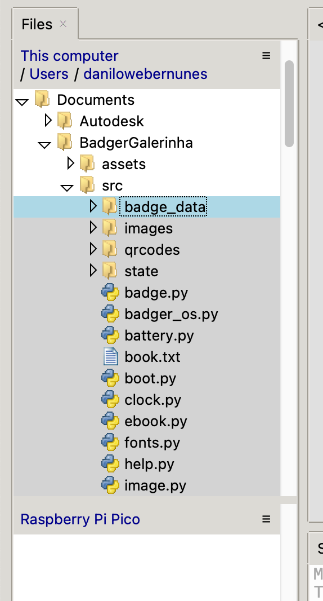
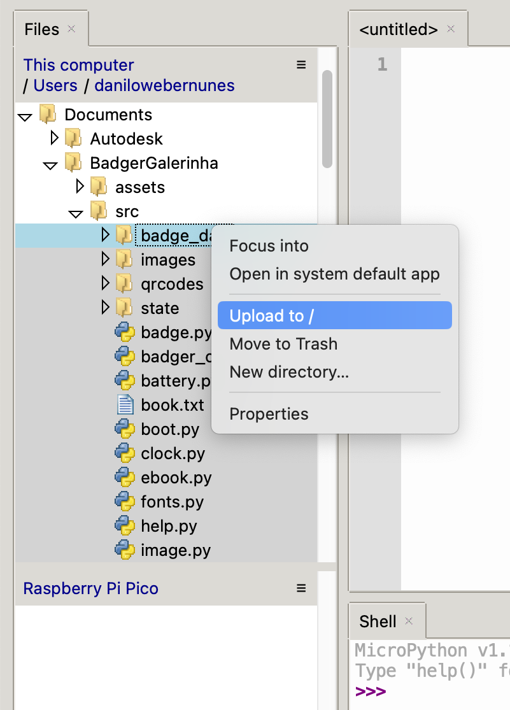

# [BadgerGalerinha](https://github.com/danilown/BadgerGalerinha)

The easiest way to get started is to go to [Getting Started](#getting-started) section. For a more detailed explanation, head to [Pimoroni's official tutorial](https://learn.pimoroni.com/article/getting-started-with-badger-2040).

This repository contains mostly customized examples from [Pimoroni's Pico repository](https://github.com/pimoroni/pimoroni-pico), which can be found more specifically under `/micropython/examples/badger2040`.

## Select Your Branch

The whole idea of this thing is for everyone to have a unique version of the Badger.

Each customization lives in a branch in this repository, so select yours:

- [Guilherme Camargo de Oliveira](https://github.com/danilown/BadgerGalerinha/tree/gui);
- [Luis Felipe Bueno da Silva](https://github.com/danilown/BadgerGalerinha/tree/luisin);
- [Luis Fernando de Oliveira Uzai](https://github.com/danilown/BadgerGalerinha/tree/uzai);
- [Rodrigo Bueno Rodrigues da Silva de Siqueira](https://github.com/danilown/BadgerGalerinha/tree/diga1);
- [Vinícius Ferraz](https://github.com/danilown/BadgerGalerinha/tree/vini);

## Getting Started

### Tweaking just some small things

0. Install [Thonny](https://thonny.org/) to be able to easily interact with the board.

1. Simply connect the Badger to your computer using an USB-C cable.

2. Open [Thonny](https://thonny.org/), and be sure that the Badger was correctly recognized. You should see something like "Raspberry Pi Pico" of the left panel (like shown in bottom part of Fig.1) and all the files withing the Badger. If that's not the case, try clicking the Stop/Restart backend button and it should appear.

3. Change the files withing the Badger as you want.

### Tinkering a bit more

0. Install [Thonny](https://thonny.org/) to be able to easily interact with the board.

1. Put the Badger into bootloader mode by plugging it into the computer through the USB port while holding down its BOOT button. The Badger will mount as a drive named RPI-RP2 on your computer.

> **Note**: Be sure that the Badger has **no external power** (i.e. turn off the battery switch).

2. Copy the downloaded firmware (`.uf2` file) to the Badger as described in the [Firmware section](#firmware) and in [Pimoroni's official tutorial](https://learn.pimoroni.com/article/getting-started-with-badger-2040) into the RPI-RP2 mounted volume.

3. Open [Thonny](https://thonny.org/), and be sure that the Badger was correctly recognized. If you see something like "Raspberry Pi Pico" of the left panel (like shown in bottom part of Fig.1), you are good. If not, try clicking the Stop/Restart backend button and it should appear.

4. You now need to copy **all** files and folders from the `/src` folder into the Badger. To do so, select the items one by one while holding CTRL (or Command) as shown in Fig. 1, and just click with the right mouse button and select "Upload to /", as shown in Fig. 2.


> Fig. 1: Files that need to be selected in Thonny, shown in light grey.


> Fig. 2: After selecting the files, click on them with the right button of the mouse and select "Upload to /".

5. Have Fun!

## Customizing the Badger

For the text, you just need to edit the `/badger_data/badge.txt` file and change what you want.

If you want finer control, you can edit the `badge.py` file under the `/src` directory.

> **FYI**: The version running on your Badger was slightly modified.

For the image:

0. The image must be exactly **104 pixels in width and 128 pixels in height**.
1. Convert your image to the `.bin` format that the Badger can interpret with the command: `python3 convert.py --binary badge-image.png`. You can find this script in the `/utils` folder.
   > Be sure that you have Pil installed in your environment: `pip3 install pillow`.
2. Be sure to place the newly generated image in the `/badger_data` folder in the Badger internal storage.

## QR Codes

To generate QR code, you just need to add `.txt` files in the `/src/qrcodes` folder.

This files needs to respect the following format:

1. The First line has to contain the URL that will be converted into QR code;
2. The Second line is the Title of the QR code, and will be displayed with a bigger font size;
3. The following lines will be displayed with a smaller font size;

### Wi-Fi Codes

Wi-Fi QR can actually represented as URL's, so we can add Wi-Fi QR codes into our Badger just by following a special URL scheme.

You just need to follow the example provided at `/src/qrcodes/wifi_guest7.txt`.

[Code Pen's Wi-Fi URL scheme generator](https://codepen.io/04/pen/eLWWNd) can generate these URL's simply and easily, you just need to insert the name of the Wi-Fi network and the password.

**There is no need to scape characters here**!

> **Note**: if you don't know the encryption type, your router is probably using WPA.

## Firmware

To be able to program the Badger, you'll need the correct version of the micropython interpreter [here](https://github.com/pimoroni/pimoroni-pico/releases).

> the release being used in this repository is [v1.19.6](https://github.com/pimoroni/pimoroni-pico/releases/tag/v1.19.6).

Note that you have to choose the correct build for the Badge. The naming schema seems to not be fixed yet, but you should choose the one that looks something like `pimoroni-badger2040-v1.19.6-micropython-without-badger-os.uf2`.

This interpreter does not contain the extra files from Pimoroni, because everything you need is (technically) already in this repository.

If you want, you can use the version with Badger OS (`pimoroni-badger2040-v1.19.6-micropython.uf2`) as well and do the customizations yourself.

## Badger API

The API provided by Pimoroni is basically to control the e-ink display.

You will probably will come around statements like:

```python
badger = badger2040.Badger2040()
```

or

```python
display = badger2040.Badger2040()
```

All functions are decently documented at Pimoroni's repository [here](https://github.com/pimoroni/pimoroni-pico/tree/main/micropython/modules/badger2040).

## The problem with the official release

> and how it was solved

Release v1.19.6 seams to have some bugs with the Badger.

First, the `launchericons` module (more specifically, the `launchericons.py` file) is missing. According to [Issue 262](https://github.com/pimoroni/pimoroni-pico/issues/262) it should be a built-in module, but it is not.

Having a look at previous releases, this module is autogenerated from the `launchericons.png` file (located under `/micropython/examples/badger2040/assets/` in the original repository) using the `data_to_py.py` script. In this repository, it is found under `/utils/data_to_py.py`. In a few words, it will convert the image file into an importable Python module.

> In Pimoroni's repository, the `data_to_py.py` script can be found under `/examples/badger2040/image_converter/`.

So, in this repository this was exactly done and already included.

Now the problem is that the icons are corrupted. To solve this, the older version ([v1.18.2](https://github.com/pimoroni/pimoroni-pico/releases/tag/1.18.2), to be precise) of the `launchericons.py` file.
